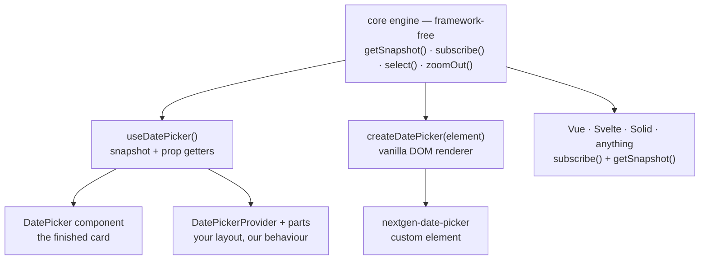
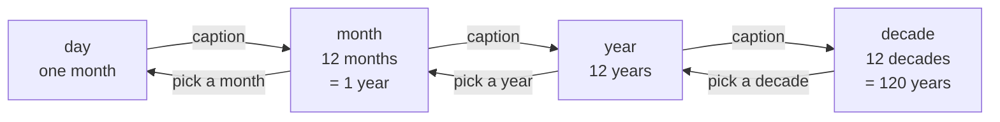

<h1 align="center">datepicker-nextgen</h1>

<p align="center">
  A headless-first, timezone-safe, fully accessible date picker for React and vanilla JS — with a production-grade default look.
</p>

<p align="center">
  <a href="https://www.npmjs.com/package/datepicker-nextgen"></a>
  <a href="https://bundlephobia.com/package/datepicker-nextgen"></a>
  <a href="https://github.com/karthikbaikati/datepicker-nextgen/actions/workflows/ci.yml"></a>
  <a href="./LICENSE"></a>
  
  
</p>

<p align="center">
  <a href="https://karthikbaikati.github.io/datepicker-nextgen/"><strong>Live demo →</strong></a>
  ·
  <a href="./docs/getting-started.md">Getting started</a>
  ·
  <a href="./docs/api-reference.md">API reference</a>
  ·
  <a href="./docs/recipes.md">Recipes</a>
</p>

---

## Install — the whole thing, start to finish

```bash
npm i datepicker-nextgen
```

```tsx
import { DatePicker } from 'datepicker-nextgen';
import 'datepicker-nextgen/styles.css'; // ← do not skip this line

export function TripDates() {
  return <DatePicker mode="range" numberOfMonths={2} minNights={2} />;
}
```

That is a working, keyboard-navigable, screen-reader-labelled, dark-mode-aware two-month range
picker. Nothing else to configure, no provider to mount, no CSS-in-JS runtime.

**The stylesheet is the one step people forget.** It is a plain global sheet — import it once,
anywhere in your app (`app/layout.tsx`, `main.tsx`, a top-level `index.css`). Without it the picker
still works perfectly; it just renders as unstyled buttons and looks broken. Every rule in it is
scoped under `.dpng`, so it cannot touch the rest of your page.

<details>
<summary><strong>No bundler? One file, no build step.</strong></summary>

```html
<link rel="stylesheet" href="https://esm.sh/datepicker-nextgen/styles.css" />

<input id="dates" placeholder="Add dates" />

<script type="module">
  import { attachDatePicker } from 'https://esm.sh/datepicker-nextgen/vanilla';

  attachDatePicker(document.querySelector('#dates'), {
    mode: 'range',
    numberOfMonths: 2,
    minNights: 2,
    disablePast: true,
  });
</script>
```

</details>

## Requirements

| You need          | Version                                                                   | Why / notes                                                                                                                                                                 |
| ----------------- | ------------------------------------------------------------------------- | --------------------------------------------------------------------------------------------------------------------------------------------------------------------------- |
| **Node**          | `>=18`                                                                    | Build and SSR. Declared in `engines`.                                                                                                                                       |
| **React**         | `>=18.0.0` — _optional_ peer                                              | Only for `datepicker-nextgen` (the React entry). The hook is built on `useSyncExternalStore` and `useId`, both React 18 APIs, with no compat shim — React 17 will not work. |
| **React DOM**     | `>=18.0.0` — _optional_ peer                                              | Same story. Needed for the portalled `popover` / `modal` / `sheet` variants.                                                                                                |
| **No React**      | —                                                                         | `datepicker-nextgen/core` and `datepicker-nextgen/vanilla` have zero peers and zero runtime dependencies.                                                                   |
| **TypeScript**    | 4.7+ with `moduleResolution: node16`/`nodenext`, or 5.0+ with `bundler`   | Types resolve through the `exports` map, so the older `node` resolution will not find the subpaths. Built and tested on TS 5.x, `strict` + `noUncheckedIndexedAccess`.      |
| **Browsers**      | Evergreen Chrome, Edge, Firefox, Safari; iOS Safari 15.4+; Android Chrome | The script targets ES2020; the floor comes from the stylesheet. See [Browser support](#browser-support). No polyfills shipped or needed.                                    |
| **Module format** | ESM + CJS                                                                 | Both are published, and the `exports` map declares types per condition — `.d.ts` under `import`, `.d.cts` under `require` — so a CJS consumer gets types too.               |

Four entry points, plus the themes:

| Specifier                         | Contains                                                           | Needs React |
| --------------------------------- | ------------------------------------------------------------------ | ----------- |
| `datepicker-nextgen`              | React components, hook, context — plus a slice of the core         | yes         |
| `datepicker-nextgen/core`         | The headless engine, date math, constraints, presets, i18n, parser | no          |
| `datepicker-nextgen/vanilla`      | DOM renderer, `attachDatePicker`, `<nextgen-date-picker>`          | no          |
| `datepicker-nextgen/styles.css`   | The whole stylesheet, all variants, light + dark                   | no          |
| `datepicker-nextgen/themes/*.css` | One token-only override file per bundled theme                     | no          |

**The React entry re-exports a slice of the core, not all of it** — 64 of the core's 133 runtime
exports. That slice is chosen to be the one a React app actually reaches for: every adapter, every
preset builder, the formatters, labels and locale helpers, the free-text parser, and the everyday
date math (`plainDate`, `today`, `toISODate`, `fromISODate`, `addDays` / `addMonths` / `addWeeks` /
`addYears`, `subDays`, `startOfMonth` / `endOfMonth`, `startOfWeek` / `endOfWeek`, `isSameDay`,
`isBefore` / `isAfter`, `compareDates`, `diffInDays`, `rangeLength`). The other 69 — including
`getISOWeek`, `getQuarter`, `startOfQuarter`, `isLeapYear`, `daysInMonth`, `isWeekend` and the
calendar builders — are a deep import away: `import { getISOWeek } from 'datepicker-nextgen/core'`.

## Pick your path

Everything below drives the same engine. Start anywhere; you can drop a level at any time without
rewriting your integration.



<details open>
<summary><strong>1 · The batteries-included React component</strong></summary>

The flagship booking card: a two-night minimum, already-booked nights blocked out, and the duration
badge that reads `21 nights`.

```tsx
import { useState } from 'react';
import { DatePicker } from 'datepicker-nextgen';
import { bookingPresets } from 'datepicker-nextgen/core';
import type { SelectionValue } from 'datepicker-nextgen';
import 'datepicker-nextgen/styles.css';

export function TripDates() {
  const [stay, setStay] = useState<SelectionValue | null>(null);

  return (
    <DatePicker
      mode="range"
      title="Trip dates"
      minNights={2}
      maxNights={30}
      disablePast
      blockedRanges={[
        { start: '2026-09-11', end: '2026-09-14' },
        { start: '2026-09-28', end: '2026-10-02' },
      ]}
      presets={bookingPresets}
      onChange={(value) => setStay(value)}
      onComplete={(value) => console.log(value.range)}
    />
  );
}
```

`value.range` is `{ start: PlainDate | null, end: PlainDate | null }`. Want `Date` objects or ISO
strings instead? Pass `valueAdapter={nativeDateAdapter}` (or `isoStringAdapter`).

</details>

<details>
<summary><strong>2 · The headless React hook — your markup, our behaviour</strong></summary>

```tsx
import { useDatePicker } from 'datepicker-nextgen';

export function TinyCalendar() {
  const {
    snapshot,
    getRootProps,
    getCalendarProps,
    getGridProps,
    getDayProps,
    getPreviousMonthProps,
    getNextMonthProps,
  } = useDatePicker({ mode: 'range' });

  const month = snapshot.months[0];
  if (!month) return null;

  return (
    <div {...getRootProps({ className: 'my-card' })}>
      <header>
        <button {...getPreviousMonthProps()}>‹</button>
        <h2>{month.label}</h2>
        <button {...getNextMonthProps()}>›</button>
      </header>

      <div {...getCalendarProps()}>
        <div {...getGridProps(month)}>
          {month.weeks.map((week) => (
            <div key={week.key} role="row">
              {week.days.map((day) => (
                <button key={day.key} {...getDayProps(day)}>
                  {day.label}
                </button>
              ))}
            </div>
          ))}
        </div>
      </div>

      <p aria-live="polite">{snapshot.summary}</p>
    </div>
  );
}
```

No stylesheet needed here: the prop getters carry both the `dpng-*` classes _and_ a `data-*`
attribute per state (`data-selected`, `data-in-range`, `data-preview`, `data-blocked`, …), so
Tailwind's `data-[selected=true]:` variants can style the whole thing. Full walkthrough in
[docs/headless.md](./docs/headless.md).

</details>

<details>
<summary><strong>3 · Framework-free vanilla</strong></summary>

```html
<link rel="stylesheet" href="https://esm.sh/datepicker-nextgen/styles.css" />
<!-- `theme: 'midnight'` only sets `data-theme`; the tokens live in this file. -->
<link rel="stylesheet" href="https://esm.sh/datepicker-nextgen/themes/midnight.css" />

<div id="calendar"></div>

<script type="module">
  import { createDatePicker, normalizePresets } from 'https://esm.sh/datepicker-nextgen/vanilla';

  const picker = createDatePicker('#calendar', {
    mode: 'range',
    numberOfMonths: 2,
    presets: normalizePresets(['this-weekend', '1-week']),
    theme: 'midnight',
  });

  picker.on('complete', ({ selection }) => {
    console.log(selection.range.start, selection.range.end);
  });
</script>
```

`createDatePicker(target, options)` renders inline into any element or selector;
`attachDatePicker(input, options)` hangs a popover off an `<input>`, writes the formatted value
back, and parses whatever the user types. Both return the same instance API — the methods
`update`, `getValue`, `setValue`, `open`, `close`, `toggle`, `on` and `destroy`, plus two readonly
properties: `engine`, the headless engine underneath, and `element`, the `.dpng` root node. Both
emit `change`, `complete`, `clear`, `monthchange`, `open` and `close`.

`on()` is generic over the event name, so the payload is typed rather than `unknown`: `change`,
`complete` and `clear` hand you a `DatePickerChangeDetail` (`value`, `selection`, `meta`),
`monthchange` a `PlainDate`, and `open` / `close` nothing at all.

</details>

<details>
<summary><strong>4 · The <code>&lt;nextgen-date-picker&gt;</code> custom element</strong></summary>

For Rails, Django, Laravel, or any page that ends at `<script type="module">`.

```html
<link rel="stylesheet" href="https://esm.sh/datepicker-nextgen/styles.css" />

<script type="module">
  import { defineDatePickerElement } from 'https://esm.sh/datepicker-nextgen/vanilla';
  defineDatePickerElement();

  document.querySelector('nextgen-date-picker').addEventListener('complete', (event) => {
    console.log(event.detail.selection.range);
  });
</script>

<nextgen-date-picker
  mode="range"
  months="2"
  min-nights="2"
  disable-past
  presets="this-weekend,1-week"
  value="2026-09-04..2026-09-25"
></nextgen-date-picker>
```

Fifty observed attributes cover the flat options (`mode`, `min`, `max`, `months`, `locale`, `theme`,
`week-numbers`, `blocked-ranges`, …); properties cover the rich ones (functions, formatters, custom
presets). Add `for="some-input-id"` and it attaches as a popover to that input instead of rendering
inline. It renders into its own light DOM on purpose — a shadow root would lock out the global
stylesheet. See [docs/vanilla.md](./docs/vanilla.md).

</details>

<details>
<summary><strong>5 · Vue, Svelte, Solid — or whatever you are using</strong></summary>

There is no adapter package to wait for. The engine is a plain store: an immutable snapshot, a
subscribe function, and imperative methods. `getSnapshot()` returns the **same reference** until
something actually changes, which is exactly what every reactive system wants.

```ts
import { createDatePicker } from 'datepicker-nextgen/core';

const engine = createDatePicker({ mode: 'range', minNights: 2 });

const unsubscribe = engine.subscribe(() => render(engine.getSnapshot()));

engine.select('2026-09-08');
engine.hover('2026-09-12'); // drives the preview band
engine.select('2026-09-12');
engine.getValue(); // { start: PlainDate, end: PlainDate }

unsubscribe();
engine.destroy();
```

The snapshot already contains every ARIA attribute, every state flag and every localized string per
day — you write the template, not the logic. Worked Vue 3, Svelte 5 and Solid components live in
[docs/headless.md](./docs/headless.md).

</details>

## Why another date picker

**1. A timezone-safe core.** The engine never constructs a `Date` to do arithmetic. Everything is a
`PlainDate` — `{ year, month, day }`, no hour, no offset, no DST. That deletes the entire class of
"the booking shifted a day for users in Auckland" bugs. `Date`, ISO strings, timestamps, Day.js,
Luxon and Temporal are all supported, but only at the boundary, through
[adapters](./docs/api-reference.md#adapters).

**2. A headless engine with prop getters.** All the state, constraint math, ARIA wiring and keyboard
handling lives in a framework-free store. Use the styled components, replace one of them, or render
nothing that ships with the library — the behaviour is identical.

**3. One library for React _and_ vanilla.** Every `dpng-` class the React components emit also comes
out of the vanilla renderer — nothing in the stylesheet is React-only — so one stylesheet serves
both. The two do not produce byte-identical DOM: the vanilla renderer builds its footer, fields,
preset and time scaffolding up front and hides what is unused, where React renders those parts only
when you ask for them.

Everything else follows: seven selection modes, per-night blocked ranges, minimum-stay rules,
presets, per-day price/dot/badge decoration, seven looks, RTL, century navigation, and a `dpng-`
class contract that is a documented public API rather than an implementation detail.

## Century navigation

September 2026 to March 1955 is 858 presses of `‹`. Nobody is doing that, and a year dropdown that
stops at 1950 only moves the problem. So the calendar zooms instead.

The caption in the nav bar is a button. Press it and the calendar steps **out** one level; click a
cell and it steps **in** one level. Every level above `day` is the same twelve-cell grid (3 × 4);
only the unit changes. A cell is one month, then one year, then one decade — so a screen covers one
year, then twelve years, then 120.



| Level    | One screen shows          | One cell is | `snapshot.zoom.cells` keys              |
| -------- | ------------------------- | ----------- | --------------------------------------- |
| `day`    | one month                 | one day     | empty — the month grid _is_ the content |
| `month`  | one year                  | one month   | `"2026-09"`                             |
| `year`   | twelve years              | one year    | `"2026"`                                |
| `decade` | twelve decades, 120 years | one decade  | `"2020s"`                               |

Screens are **aligned blocks**, never windows sliding around the visible month: a decade screen
starts on a multiple of 120, so September 2026 sits on the screen labelled `1920s – 2030s`, and so
does March 1955. Paging with the chevrons moves a whole aligned screen at a time, which means the
same block always comes back however you got there.

The practical consequence: three presses of the caption take you from any month out to that
120-year screen, and from there **any date in it is four clicks away** — decade, year, month, day.
The trip is symmetric: three presses back out lands on that same screen, and three clicks in
returns you to any month you like.

Keyboard, inside a zoomed-out grid: arrows move one cell (up/down move three, because the grid is
three wide), <kbd>PageUp</kbd> / <kbd>PageDown</kbd> page a whole screen, <kbd>Enter</kbd> /
<kbd>Space</kbd> zoom in, and <kbd>Esc</kbd> zooms **out** rather than closing the picker. The ARIA
grid pattern and the roving tabindex are identical at every level, so the keyboard model never
changes under the user.

Drive it yourself from any binding:

```ts
engine.setView('decade'); // jump straight to a level
engine.zoomOut(); // day → month → year → decade, and stops there
engine.zoomIn('1955-03-01'); // one level in, moving the view in the same transition
engine.getSnapshot().zoom; // { level, label, canZoomIn, canZoomOut, cells }
```

> **`yearRange` is navigation reach, never a constraint.** It sizes the year list in
> `snapshot.years` — the year dropdown you get with `monthCaptionLayout="dropdown"` — and defaults
> to 100 years either side of the visible month. It does **not** restrict what can be selected, and
> it does not bound the zoom grids; those answer to `minDate` / `maxDate` alone. Use `minDate` and
> `maxDate` when you mean "not selectable".

## What is actually in the box

### Selection modes

| Mode       | Click behaviour                    | Value lives in   |
| ---------- | ---------------------------------- | ---------------- |
| `single`   | one date                           | `value.dates[0]` |
| `range`    | start, then end                    | `value.range`    |
| `multiple` | toggles individual dates           | `value.dates`    |
| `week`     | selects the whole display week     | `value.range`    |
| `month`    | selects the whole calendar month   | `value.range`    |
| `quarter`  | selects the whole calendar quarter | `value.range`    |
| `year`     | selects the whole calendar year    | `value.range`    |

Plus `rangeSemantics: 'nights' | 'days'` (Sep 4 → Sep 25 is _21 nights_ or _22 days_),
reverse-range repair, toggle-on-reselect, auto-advance from start to end, and `resetOnComplete`.

### Constraints

`minDate` · `maxDate` · `disabledDates` (list, ranges, or predicate) · `enabledDates` (allowlist) ·
`disabledDaysOfWeek` · `blockedRanges` · `disablePast` · `disableFuture` · `disableWeekends` ·
`minNights` / `maxNights` · `minSelections` / `maxSelections` · `rollingSelection` ·
`preventCrossingBlocked` · `isDateUnavailable(date, ctx)` for anything else.

Every rejection carries a typed `DisabledReason` (`min-nights`, `crosses-blocked`,
`not-in-allowlist`, …) that reaches the cell, the tooltip, the screen reader and
`onInvalidSelection` — so you can raise a toast that says _why_.

### i18n

`Intl`-driven month, weekday, duration and summary formatting · locale-derived first day of week and
weekend days · automatic RTL (`dir` is set for you) · ISO-8601 week numbers · every user-visible
string overridable via `labels` · every formatter overridable via `formatters` · locale-aware
free-text parsing (`"9/4/2026"` vs `"4/9/2026"`, `"Sep 4"`, `"next friday"`, `"+2w"`).

### Accessibility

WAI-ARIA grid pattern (`role="grid"` / `row` / `gridcell` / `rowheader`) · roving tabindex, exactly
one `tabIndex: 0` cell per calendar · unavailable days stay focusable with `aria-disabled` rather
than `disabled` · full keyboard map including `Ctrl+Home/End` and `Shift+PageUp/Down` ·
`aria-live="polite"` announcements on selection, clear and month change · focus trap and focus
return for the popover, modal and sheet variants · `prefers-reduced-motion` respected · a
`high-contrast` theme that clears WCAG AAA. See [docs/accessibility.md](./docs/accessibility.md).

### Theming

Every colour, radius, size, shadow and duration resolves through a `--dpng-*` custom property — no
component rule hard-codes a value, and 59 of those tokens are documented as public API. Seven looks
ship in the box: the built-in default (which follows
`prefers-color-scheme` and can be pinned with `data-theme="light" | "dark"`), plus six token-only
theme files you import only if you want them.

| Theme           | Stylesheet                                    | For                                      |
| --------------- | --------------------------------------------- | ---------------------------------------- |
| _default_       | included in `styles.css`                      | Follows the OS; blue accent              |
| `midnight`      | `datepicker-nextgen/themes/midnight.css`      | Unconditionally dark slate + indigo      |
| `emerald`       | `datepicker-nextgen/themes/emerald.css`       | Emerald-700 over warm stone              |
| `rose`          | `datepicker-nextgen/themes/rose.css`          | Rose-600, pink hairlines, generous radii |
| `mono`          | `datepicker-nextgen/themes/mono.css`          | Black, white, grey — dense admin chrome  |
| `glass`         | `datepicker-nextgen/themes/glass.css`         | Frosted card over photography or video   |
| `high-contrast` | `datepicker-nextgen/themes/high-contrast.css` | WCAG AAA pairs, 2px borders              |

```tsx
import 'datepicker-nextgen/styles.css';
import 'datepicker-nextgen/themes/midnight.css';

<DatePicker theme="midnight" />;
```

Three sizes · four variants (`inline`, `popover`, `modal`, `sheet`) · every stateful class mirrored
as a `data-*` attribute so Tailwind's `data-[selected=true]:` variants work out of the box ·
`dayMeta` for per-day prices, dots, badges and tooltips. See [docs/theming.md](./docs/theming.md).

## Recipes

<details open>
<summary><strong>Booking range: minimum stay, maximum stay, blocked nights</strong></summary>

```tsx
<DatePicker
  mode="range"
  numberOfMonths={2}
  minNights={2}
  maxNights={28}
  disablePast
  preventCrossingBlocked
  blockedRanges={[{ start: '2026-09-11', end: '2026-09-14' }]}
  onInvalidSelection={(date, evaluation) => toast(evaluation.message ?? 'Not available')}
/>
```

`preventCrossingBlocked` (on by default) means a guest cannot select Sep 10 → Sep 16 _over_ an
occupied night; the hover preview stops dead at Sep 10.

</details>

<details>
<summary><strong>Analytics preset sidebar</strong></summary>

```tsx
import { DatePicker } from 'datepicker-nextgen';
import { analyticsPresets } from 'datepicker-nextgen/core';

<DatePicker
  mode="range"
  rangeSemantics="days"
  presets={analyticsPresets}
  orientation="vertical"
  disableFuture
  onComplete={(value) => refetch(value.range)}
/>;
```

`analyticsPresets` is Today · Yesterday · Last 7 / 30 / 90 days · This month · Last month ·
This quarter · Year to date.

</details>

<details>
<summary><strong>Birthday picker — the century navigation earning its keep</strong></summary>

```tsx
<DatePicker
  mode="single"
  defaultMonth="1994-01-01"
  maxDate={new Date()}
  onChange={(value) => setBirthday(value.dates[0])}
/>
```

`defaultMonth` puts the user in the right decade to begin with; the caption zooms out to the
`1920s – 2030s` screen for anyone who lands in the wrong one.

Note that `monthCaptionLayout="dropdown"` is the **alternative** to this, not an addition to it: at
the day level the two native selects take the caption's place, so the caption is no longer a
zoom-out button. Pick the selects (and size their year list with `yearRange`) or pick the zoom —
not both.

</details>

<details>
<summary><strong>Multiple dates, capped at five</strong></summary>

```tsx
<DatePicker
  mode="multiple"
  maxSelections={5}
  rollingSelection // a 6th pick evicts the oldest instead of being rejected
  onChange={(value) => setDates(value.dates)}
/>
```

</details>

<details>
<summary><strong>Week picker with ISO week numbers</strong></summary>

```tsx
<DatePicker
  mode="week"
  showWeekNumbers
  firstDayOfWeek={1}
  onComplete={(value) => setReportingWeek(value.range)}
/>
```

Any click selects that entire display week as a range.

</details>

<details>
<summary><strong>Date + time</strong></summary>

```tsx
<DatePicker
  mode="single"
  time={{
    enabled: true,
    minuteStep: 15,
    minTime: { hour: 9, minute: 0, second: 0 },
    maxTime: { hour: 18, minute: 0, second: 0 },
    defaultStartTime: { hour: 10, minute: 0, second: 0 },
  }}
  onChange={(value) => setSlot({ date: value.dates[0], time: value.times?.start })}
/>
```

</details>

<details>
<summary><strong>Controlled, with react-hook-form</strong></summary>

```tsx
import { Controller, useForm } from 'react-hook-form';
import { DatePicker } from 'datepicker-nextgen';
import { isoStringAdapter, toExternalValue } from 'datepicker-nextgen/core';

const { control } = useForm({ defaultValues: { stay: { start: null, end: null } } });

<Controller
  name="stay"
  control={control}
  render={({ field }) => (
    <DatePicker
      mode="range"
      value={field.value}
      valueAdapter={isoStringAdapter}
      onChange={(value) => field.onChange(toExternalValue(value, 'range', isoStringAdapter))}
    />
  )}
/>;
```

`field.value` is `{ start: '2026-09-04', end: '2026-09-25' }` — exactly what you want to POST.

</details>

More in **[docs/recipes.md](./docs/recipes.md)**: hotel prices in the cells, flexible-date strips,
API-driven availability, fiscal quarters, appointment slots, responsive multi-month layouts, Arabic
RTL, Next.js App Router, URL-synced dashboard ranges, and Testing Library.

## Troubleshooting

| Symptom                                                           | Cause                                                                                                                                                                              | Fix                                                                                                                                                                                                                                            |
| ----------------------------------------------------------------- | ---------------------------------------------------------------------------------------------------------------------------------------------------------------------------------- | ---------------------------------------------------------------------------------------------------------------------------------------------------------------------------------------------------------------------------------------------- |
| Calendar renders as a pile of unstyled buttons                    | The stylesheet was never imported. `sideEffects` is `["**/*.css"]`, so the stylesheet and the theme files are the package's declared side effects — nothing pulls them in for you. | `import 'datepicker-nextgen/styles.css'` once, app-wide.                                                                                                                                                                                       |
| `useSyncExternalStore is not a function`, or `useId` is undefined | React 17 or older. The hook uses React 18 APIs directly and ships no compat shim.                                                                                                  | Upgrade to React `>=18`, or use `datepicker-nextgen/core` / `/vanilla`, which need no React at all.                                                                                                                                            |
| Next.js says a React hook only works in a Client Component        | The React component is interactive.                                                                                                                                                | Put `'use client'` at the top of the file that renders `<DatePicker>`. `datepicker-nextgen/core` is pure and safe to import from a server component.                                                                                           |
| SSR hydration warning about the visible month                     | The server's "today" is the server's timezone; the browser's is the user's.                                                                                                        | Pass an explicit `timeZone="America/New_York"`, or an explicit `today`. Both are engine options, so they work in every binding.                                                                                                                |
| `--dpng-*` overrides silently do nothing                          | The defaults are declared **on `.dpng` itself**, and a declaration on an element always beats a value inherited from an ancestor — whatever the ancestor's specificity.            | Target the picker root, not a wrapper (see below).                                                                                                                                                                                             |
| Setting `value` makes the picker feel frozen                      | `value` puts the engine in controlled mode: it never mutates its own value and waits for you to pass a new one.                                                                    | Use `defaultValue` for uncontrolled, or wire `onChange` back into `value`.                                                                                                                                                                     |
| `<nextgen-date-picker>` ignores an option you set as an attribute | Only the fifty flat options are observed attributes. The rich ones — functions, formatters, custom presets — have no sensible attribute form and are properties instead.           | Assign the property: `el.dayMeta = …`, `el.presets = …`, `el.labels = …`, or `el.options = { … }` for a patch. (`value` _is_ observed: writing the attribute applies the new selection, and so do `el.value = …` and `el.picker.setValue(…)`.) |
| Importing only `useDatePicker` did not shrink the bundle          | The React entry is one chunk; the hook carries the components with it.                                                                                                             | Import from `datepicker-nextgen/core` and drive the engine yourself — see [Bundle size](#bundle-size).                                                                                                                                         |

### The token-scoping trap

```css
.checkout-panel .dpng {
  --dpng-cell-size: 44px;
} /* ✅ every picker in that region */

.checkout-panel {
  --dpng-cell-size: 44px;
} /* ❌ silently ignored          */
```

```html
<div class="dpng" style="--dpng-accent: #059669">
  <!-- ✅ one instance -->
</div>
```

The rule is one line long: **the selector must match the picker root**, because the default token
values live on `.dpng`, and inheritance never beats a declaration on the element itself.

## Bundle size

| Entry                           | What you get                                                             |
| ------------------------------- | ------------------------------------------------------------------------ |
| `datepicker-nextgen/core`       | Engine, constraints, presets, calendar builder, parser, adapters — no UI |
| `datepicker-nextgen`            | The core plus the React components and hooks                             |
| `datepicker-nextgen/vanilla`    | The core plus the DOM renderer and the custom element                    |
| `datepicker-nextgen/styles.css` | The whole stylesheet, all variants and both colour schemes               |

Measured by installing the packed tarball and bundling it with esbuild — `--bundle --minify
--format=esm --target=es2020`, React external, then `gzip -9`:

| You import                                           | gzip    |
| ---------------------------------------------------- | ------- |
| `createDatePicker` from `datepicker-nextgen/core`    | 20.1 kB |
| everything from `datepicker-nextgen/core`            | 22.6 kB |
| `createDatePicker` from `datepicker-nextgen/vanilla` | 28.7 kB |
| `DatePicker` from `datepicker-nextgen`               | 30.2 kB |
| `styles.css`                                         | 17.4 kB |

Two honest caveats about those numbers:

- **The engine really does depend on the parser and the preset resolver**, because `parseInput()`
  and `applyPreset()` are part of its API. They are not dead code and tree-shaking will not remove
  them — that is the whole difference between the first two rows.
- **Importing only `useDatePicker` costs the same as importing `DatePicker`.** The React entry point
  is a single code-split chunk, so pulling in the headless hook still carries the components. If you
  are building a fully custom UI and want none of them, import from `datepicker-nextgen/core` and
  drive the engine with `useSyncExternalStore` yourself — see [docs/headless.md](./docs/headless.md).

Run `npm run size` in a clone for the per-file figures from your own build — it walks `dist/` and
reports every published ESM bundle and stylesheet (the CJS bundles and the declaration files are
left out).

## Browser support

Evergreen Chrome, Edge, Firefox and Safari, plus **iOS Safari 15.4+** and Android Chrome. Node 18+
for SSR. No polyfills are shipped or needed.

The script targets ES2020 and would run further back than that; **the floor comes from
`styles.css`**, and it is worth knowing which rules set it:

| Feature                     | Needs       | Used for                                                              |
| --------------------------- | ----------- | --------------------------------------------------------------------- |
| `:focus-visible`            | Safari 15.4 | Every focus ring — the visible half of the accessibility story        |
| `aspect-ratio`              | Safari 15.0 | Keeping the `.dpng-day::before` selection disc circular in any cell   |
| `translate:` (the property) | Safari 14.1 | Centring that disc without clobbering the `:active` scale `transform` |
| Flex and grid `gap`         | Safari 14.1 | Nearly every row: nav, fields, presets, footer, the zoom grids        |

Those four are unguarded, so 15.4 is a hard floor rather than a degraded look. Container queries
_are_ wrapped in `@supports (container-type: inline-size)` with a media-query fallback behind
`@supports not (…)`, so the responsive layout still works below that.

On the `Intl` side only **`Intl.DateTimeFormat` is load-bearing** — every month, weekday and date
string goes through it. `Intl.PluralRules` and `Intl.NumberFormat` are used for the duration string
(`21 nights`) inside a `try`/`catch` that falls back to an English plural and a plain number, and
the optional extras (`Intl.ListFormat`, `Intl.RelativeTimeFormat`, `Intl.Locale#getWeekInfo` /
`#getTextInfo`) are feature-detected the same way — localized `"next friday"` parsing degrades to
the English keywords, nothing throws.

## Documentation

| Guide                                        | What it covers                                                              |
| -------------------------------------------- | --------------------------------------------------------------------------- |
| [Getting started](./docs/getting-started.md) | Install, the four ways to use it, controlled vs uncontrolled, value shapes  |
| [API reference](./docs/api-reference.md)     | Every exported symbol, every option, every snapshot field, the CSS contract |
| [Recipes](./docs/recipes.md)                 | 16 worked, copy-pasteable product examples                                  |
| [Theming](./docs/theming.md)                 | Tokens, the bundled themes, dark mode, Tailwind, `dayMeta`                  |
| [Accessibility](./docs/accessibility.md)     | Keyboard map, ARIA, announcements, focus, how to test it                    |
| [Headless](./docs/headless.md)               | Prop getters, and the engine in Vue / Svelte / Solid                        |
| [Vanilla](./docs/vanilla.md)                 | `createDatePicker`, `attachDatePicker`, the custom element, CDN             |
| [Migration](./docs/migration.md)             | From react-datepicker, react-day-picker, @mui/x-date-pickers                |

## Contributing

Issues and PRs are welcome — see [CONTRIBUTING.md](./CONTRIBUTING.md) for dev setup, the architecture
tour and the commit conventions, and [CODE_OF_CONDUCT.md](./CODE_OF_CONDUCT.md). Security reports go
to the process in [SECURITY.md](./SECURITY.md).

```bash
npm install
npm run dev      # the demo site on http://localhost:5173
npm run verify   # lint + typecheck + tests + build — the core of what CI runs
npm run size     # gzip/brotli figures for every published ESM bundle and stylesheet
```

## License

[MIT](./LICENSE) © 2026 Karthik Baikati, DKGSL

Zero runtime dependencies, so nothing third-party ships inside the package.
[THIRD-PARTY-NOTICES.md](./THIRD-PARTY-NOTICES.md) records the handful of external
works the project draws on — the public-domain calendar algorithms, the Contributor
Covenant, and the fonts the demo site loads.

Built by **Karthik Baikati** · **DKGSL**
